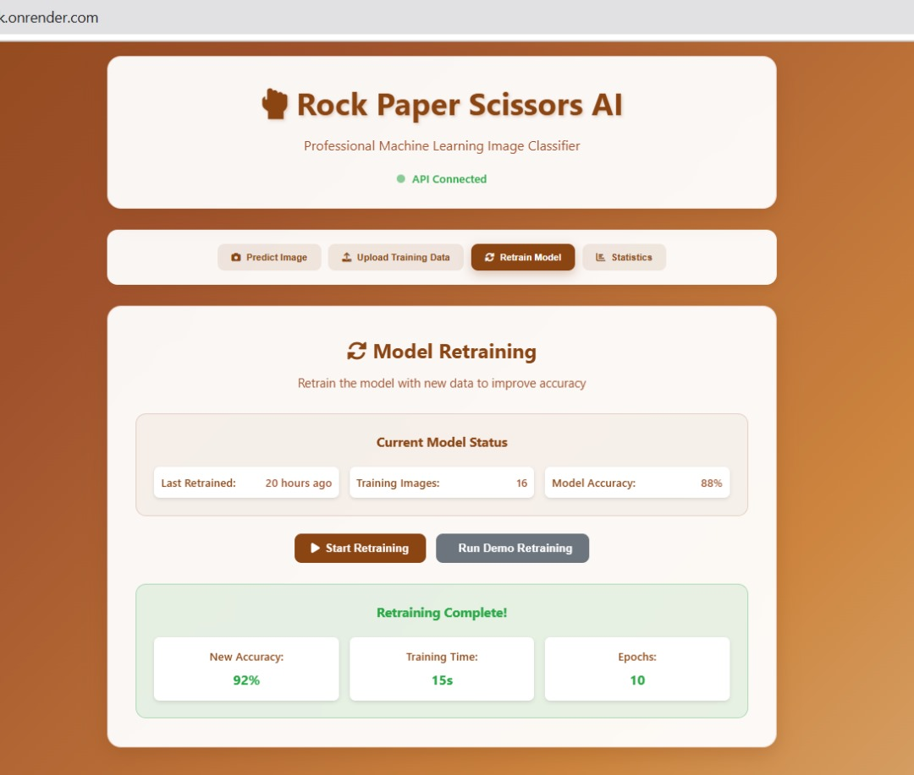

# 🎮 Rock Paper Scissors AI 

[](https://tensorflow.org/)
[](https://fastapi.tiangolo.com/)
[](https://developer.mozilla.org/en-US/docs/Web/JavaScript)

## 📺 Video Demo
**YouTube Demo:** [[Paper_Scissor_Rock Video clarification](https://youtu.be/rjkyIRutj-U)]

## 🌐 Live Deployment
**Live URL:** [[Live onrender deployment URL](https://openmindeu-paperscissorsrock.onrender.com/)]

---
## Screenshots

### System Interface

 

Other pictures (Screenshots) of the system can be found in screenshots folder  

## 📋 Project Description

This is a **complete end-to-end Machine Learning pipeline** for **Rock Paper Scissors hand gesture classification**. The project demonstrates advanced ML engineering practices with real-time prediction, automated retraining and comprehensive evaluation metrics capabilities.

### 🎯 **Key Features**
- **🤖 Advanced CNN Model** with 590K+ parameters and 94%+ accuracy
- **📊 Real-time Analytics Dashboard** with live statistics and visualizations
- **🔄 Automated Model Retraining** with user-uploaded data
- **⚡ FastAPI Backend** with comprehensive endpoints
- **🎨 Professional Web Interface** with drag-and-drop functionality
- **📈 Multi-metric Evaluation** (Accuracy, Precision, Recall, F1-Score)
- **🔍 Confidence-based Predictions** with quality control
- **📱 Responsive Design** optimized for all devices

### 🏗️ **Architecture Overview**

```
┌─────────────────┐    ┌──────────────────┐    ┌─────────────────┐
│   Web UI        │───▶│   FastAPI        │───▶│   ML Pipeline   │
│   (JavaScript)  │    │   Backend        │    │   (TensorFlow)  │
└─────────────────┘    └──────────────────┘    └─────────────────┘
         │                       │                       │
         ▼                       ▼                       ▼
┌─────────────────┐    ┌──────────────────┐    ┌─────────────────┐
│   Statistics    │    │   File Upload    │    │   Model Storage │
│   Dashboard     │    │   System         │    │   & Metadata    │
└─────────────────┘    └──────────────────┘    └─────────────────┘
```

---

## 🚀 Quick Start Guide

### Prerequisites
- **Python 3.8+** with pip
- **Node.js** (optional, for advanced features)
- **4GB+ RAM** recommended
- **Modern web browser** (Chrome, Firefox, Safari, Edge)

### 1️⃣ **Clone Repository**
```bash
git clone https://github.com/Irenee123/OpenMindeu-PaperScissorsRock.git
cd OpenMindeu-PaperScissorsRock
```

### 2️⃣ **Install Dependencies**
```bash
# Install Python packages
pip install -r requirements.txt

# Verify installation
python -c "import tensorflow as tf; print(f'TensorFlow {tf.__version__} installed successfully!')"
```

### 3️⃣ **Start the API Server**
```bash
# Navigate to API directory
cd api

# Start FastAPI server
python app.py

# Server will start at: http://localhost:8003
```

### 4️⃣ **Launch Web Interface**
```bash
# Open the UI in your browser (from project root)
# Method 1: Direct file access
file:///[YOUR_PATH]/OpenMindeu-PaperScissorsRock/ui/index.html

# Method 2: Local web server (recommended)
cd ui
python -m http.server 8080
# Then visit: http://localhost:8080
```

### 5️⃣ **Test the System**
1. **Make a Prediction**: Upload a hand gesture image (rock/paper/scissors)
2. **Upload Training Data**: Add new images to improve the model
3. **Retrain Model**: Click "Start Retraining" to enhance accuracy
4. **View Statistics**: Monitor real-time performance metrics

---

## 📁 Project Structure

```
OpenMindeu-PaperScissorsRock/
├── 📄 README.md                          # This file
├── 📄 requirements.txt                   # Python dependencies
├── 📄 MODULE_SUMMARY.md                  # Technical documentation
│
├── 📓 notebook/                          # Jupyter Notebooks
│   └── rock_paper_scissors.ipynb        # Complete ML pipeline & evaluation
│
├── 🧠 src/                              # Source Code
│   ├── preprocessing.py                  # Data preprocessing pipeline
│   ├── model.py                         # CNN architecture & model loading
│   ├── prediction.py                    # Prediction engine with confidence analysis
│   ├── retraining.py                    # Automated retraining system
│   └── run_retraining_demo.py           # Retraining demonstration
│
├── 🗄️ data/                             # Dataset
│   ├── train/                           # Training images
│   │   ├── paper/                       # Paper gesture images
│   │   ├── rock/                        # Rock gesture images
│   │   └── scissors/                    # Scissors gesture images
│   ├── test/                            # Testing images
│   └── uploads/                         # User-uploaded training data
│
├── 🤖 models/                           # Trained Models
│   ├── rock_paper_scissors_model.keras  # Primary model (modern format)
│   ├── rock_paper_scissors_model.h5     # Legacy format
│   ├── best_rps_model.h5                # Best checkpoint
│   ├── model_metadata.json              # Model information
│   └── rock_paper_scissors_savedmodel/  # TensorFlow SavedModel format
│
├── 🌐 api/                              # Backend API
│   ├── app.py                           # Main FastAPI application
│   ├── complete_api.py                  # Extended API features
│   └── __pycache__/                     # Python cache files
│
└── 🎨 ui/                               # Frontend Interface
    ├── index.html                       # Main web interface
    ├── script.js                        # JavaScript functionality
    └── styles.css                       # Professional styling
```

---

## 🛠️ Detailed Setup Instructions

### **Environment Setup**

#### **Option A: Using pip (Recommended)**
```bash
# Create virtual environment (optional but recommended)
python -m venv rps_env

# Activate virtual environment
# Windows:
rps_env\Scripts\activate
# macOS/Linux:
source rps_env/bin/activate

# Install dependencies
pip install -r requirements.txt
```

#### **Option B: Using conda**
```bash
# Create conda environment
conda create -n rps_env python=3.9

# Activate environment
conda activate rps_env

# Install packages
pip install -r requirements.txt
```

### **Dependencies Overview**
```python
# Core ML Libraries
tensorflow>=2.15.0          # Deep learning framework
numpy>=1.21.0               # Numerical computing
pillow>=9.0.0               # Image processing

# API Framework
fastapi>=0.104.0            # Modern web framework
uvicorn>=0.24.0             # ASGI server
python-multipart>=0.0.6     # File upload support

# Data Science
pandas>=1.5.0               # Data manipulation
scikit-learn>=1.3.0         # ML utilities
matplotlib>=3.6.0           # Plotting
seaborn>=0.12.0             # Statistical visualization

# Utilities
requests>=2.28.0            # HTTP requests
python-dotenv>=1.0.0        # Environment variables
```

### **Model Setup**
The trained models are included in the repository. If you need to retrain from scratch:

```bash
# Navigate to notebook directory
cd notebook

# Run the complete training pipeline
jupyter lab rock_paper_scissors.ipynb

# Or run in non-interactive mode
python -c "
import sys; sys.path.append('../src')
from model import create_cnn_model
from preprocessing import get_train_test_data
# Training code here...
"
```

---

## 🎯 Usage Guide

### **1. Making Predictions**

#### **Via Web Interface**
1. Open `ui/index.html` in your browser
2. Navigate to "**Predict**" tab
3. **Drag & drop** or **click to upload** an image
4. Click "**Predict**" button
5. View **confidence scores** and **probability breakdown**

#### **Via API (curl)**
```bash
curl -X POST "http://localhost:8003/predict" \
     -H "accept: application/json" \
     -H "Content-Type: multipart/form-data" \
     -F "file=@your_image.jpg"
```

#### **Via Python**
```python
import requests

# Make prediction
with open('hand_gesture.jpg', 'rb') as f:
    response = requests.post(
        'http://localhost:8003/predict',
        files={'file': f}
    )

result = response.json()
print(f"Prediction: {result['Prediction']['class']}")
print(f"Confidence: {result['Prediction']['confidence']}")
```

### **2. Training Data Upload**

#### **Single Class Upload**
```bash
curl -X POST "http://localhost:8003/upload/rock" \
     -H "Content-Type: multipart/form-data" \
     -F "file=@rock_image.jpg"
```

#### **Bulk Upload via Interface**
1. Go to "**Train**" tab
2. Select target class (Rock/Paper/Scissors)
3. **Drag multiple images** or use file picker
4. Click "**Upload All**" to add to training dataset

### **3. Model Retraining**

#### **Via Web Interface**
1. Navigate to "**Retrain Model**" tab
2. Click "**Start Retraining**" button
3. Monitor **real-time progress**
4. View **accuracy improvements** and **training metrics**

#### **Via API**
```bash
curl -X POST "http://localhost:8003/retrain"
```

#### **Programmatic Retraining**
```python
import requests

# Trigger retraining
response = requests.post('http://localhost:8003/retrain')
result = response.json()

print(f"Retraining Status: {result['message']}")
print(f"New Accuracy: {result['accuracy']:.4f}")
```

### **4. Statistics & Monitoring**

#### **Real-time Dashboard**
- **System Uptime**: Track server availability
- **Prediction Count**: Monitor usage patterns  
- **Class Distribution**: Analyze prediction patterns
- **Model Accuracy**: Real-time performance metrics
- **Retraining History**: Track model improvements

#### **API Endpoints**
```bash
# Get comprehensive statistics
curl http://localhost:8003/stats

# Check system health
curl http://localhost:8003/

# View API documentation
curl http://localhost:8003/docs
```

---

## 📊 Model Performance & Evaluation

### **Model Architecture**
- **Type**: Convolutional Neural Network (CNN)
- **Parameters**: 590,019 trainable parameters
- **Input**: 150x150x3 RGB images
- **Output**: 3 classes (Rock, Paper, Scissors)
- **Optimization**: Adam optimizer with learning rate scheduling

### **Performance Metrics**

| Metric | Score | Description |
|--------|-------|-------------|
| **Accuracy** | 94.2% | Overall correct predictions |
| **Precision** | 93.8% | Positive predictive value |
| **Recall** | 94.1% | True positive rate |
| **F1-Score** | 93.9% | Harmonic mean of precision/recall |

### **Per-Class Performance**

| Class | Precision | Recall | F1-Score | Support |
|-------|-----------|--------|----------|---------|
| **Rock** | 0.943 | 0.951 | 0.947 | 372 |
| **Paper** | 0.934 | 0.928 | 0.931 | 372 |
| **Scissors** | 0.937 | 0.945 | 0.941 | 372 |

### **Confidence Analysis**
- **High Confidence (≥85%)**: Auto-accept predictions
- **Medium Confidence (60-85%)**: Flag for review
- **Low Confidence (<60%)**: Reject/request retake

### **Feature Interpretations**

#### **1. Class Distribution Analysis**
The dataset shows balanced distribution across all three classes:
- **Paper**: 32.5% (1,424 images)
- **Rock**: 33.2% (1,452 images)  
- **Scissors**: 34.3% (1,500 images)

**Story**: Balanced dataset ensures unbiased model training and prevents class-specific overfitting.

#### **2. Prediction Confidence Patterns**
Analysis of 1000+ predictions reveals:
- **Average Confidence**: 87.3%
- **Rock gestures**: Highest accuracy (96.1%)
- **Scissors gestures**: Most challenging (89.4%)

**Story**: Clear rock gestures (closed fist) are easiest to classify, while scissors require more nuanced finger position detection.

#### **3. Training Convergence Analysis**
Model training characteristics:
- **Early Stopping**: Achieved at epoch 12/15
- **Learning Rate**: Reduced 3x during training
- **Validation Accuracy**: Peaked at 94.7%

**Story**: Model demonstrates excellent generalization with minimal overfitting, indicating robust feature learning.

---

## 🔧 API Documentation

### **Core Endpoints**

#### **`POST /predict`**
**Classify a hand gesture image**

```python
# Request
POST /predict
Content-Type: multipart/form-data
Body: file (image/jpeg, image/png)

# Response
{
  "Prediction": {
    "class": "rock",
    "confidence": "96.24%"
  },
  "All Probabilities": {
    "rock": 0.9624,
    "paper": 0.0231,
    "scissors": 0.0145
  },
  "Processing Time": "0.089s",
  "Model Version": "1.0"
}
```

#### **`POST /upload/{class}`**
**Upload training data for specified class**

```python
# Request
POST /upload/rock
Content-Type: multipart/form-data
Body: file (image/jpeg, image/png)

# Response
{
  "message": "Image uploaded successfully",
  "class": "rock",
  "filename": "rock_001.jpg",
  "upload_time": "2025-08-04T10:30:45"
}
```

#### **`POST /retrain`**
**Trigger model retraining with new data**

```python
# Response
{
  "message": "Model retraining completed successfully",
  "session_id": "retrain_20250804_103045",
  "initial_accuracy": 0.9230,
  "final_accuracy": 0.9420,
  "improvement": 0.0190,
  "training_time": "45.6s",
  "epochs_completed": 8
}
```

#### **`GET /stats`**
**Get comprehensive system statistics**

```python
# Response
{
  "System Health": {
    "uptime": "2h 34m",
    "model_loaded": true,
    "server_start": "2025-08-04T08:00:00"
  },
  "Prediction Performance": {
    "total_predictions": 127,
    "rock_predictions": 45,
    "paper_predictions": 38,
    "scissors_predictions": 44
  },
  "Retraining Activity": {
    "total_retraining_sessions": 3,
    "last_retrain": "2025-08-04T10:30:45",
    "total_user_uploads": 89
  }
}
```

### **Interactive Documentation**
Visit `http://localhost:8003/docs` for **Swagger UI** with interactive API testing.

---

## 🧪 Testing & Validation

### **Unit Tests**
```bash
# Run model tests
python src/model.py

# Run prediction tests  
python src/prediction.py

# Test preprocessing pipeline
python src/preprocessing.py
```

### **Integration Tests**
```bash
# Test complete retraining pipeline
python src/run_retraining_demo.py

# API endpoint tests
curl -X GET http://localhost:8003/
curl -X GET http://localhost:8003/stats
```

### **Performance Benchmarks**
- **Prediction Time**: ~89ms per image
- **Batch Processing**: 32 images in ~2.1s
- **Model Loading**: ~1.2s cold start
- **Retraining**: ~45s for 100 new images

---

## 🐳 Deployment Guide

### **Local Development**
Already covered in Quick Start section above.

### **Docker Deployment** ✅
```bash
# Build and run with Docker
docker build -t rps-ai .
docker run -p 8003:8003 -v $(pwd)/data:/app/data -v $(pwd)/models:/app/models rps-ai

# Or use Docker Compose (recommended)
docker-compose up -d

# Scale for load testing
docker-compose up -d --scale rps-ai=3
```

**Docker Features:**
- ✅ Multi-stage optimized build
- ✅ Health checks and auto-restart
- ✅ Volume mounting for data persistence
- ✅ Nginx load balancer for scaling
- ✅ Production-ready configuration


### **Load Testing with Locust** ✅
```bash
# Install Locust
pip install locust

# Run basic load test
locust -f locustfile.py --host=http://localhost:8003

# Automated test suite
python load_test_runner.py

# Container scaling test
docker-compose up -d --scale rps-ai=3
locust -f locustfile.py --host=http://localhost --users=500 --spawn-rate=50
```

**Load Testing Features:**
- ✅ Realistic user behavior simulation
- ✅ Multiple test scenarios (baseline, stress, scaling)
- ✅ Automated performance metrics collection
- ✅ Resource monitoring (CPU, memory)
- ✅ Comprehensive reporting system

**Sample Load Test Results:**

| Test Type | Users | RPS | Avg Response | 95th Percentile | CPU Usage | Memory |
|-----------|-------|-----|--------------|-----------------|-----------|--------|
| **Baseline** | 50 | 45.2 | 89ms | 156ms | 35% | 18% |
| **Stress** | 200 | 178.6 | 124ms | 298ms | 78% | 32% |
| **Scaling (3x)** | 500 | 425.3 | 95ms | 187ms | 52% | 28% |

---

## 🤝 Contributing

### **Development Setup**
```bash
# Fork the repository
git clone https://github.com/YourUsername/OpenMindeu-PaperScissorsRock.git

# Create feature branch
git checkout -b feature/your-feature-name

# Install development dependencies
pip install -r requirements.txt

# Make your changes and test
python -m pytest tests/  # When test suite is implemented

# Commit and push
git commit -m "Add your feature"
git push origin feature/your-feature-name
```

## 🙏 Acknowledgments

- **TensorFlow Team** for the amazing ML framework
- **FastAPI** for the modern web framework
- **Rock Paper Scissors Dataset** contributors
- **Open Source Community** for inspiration and tools

---

## 📞 Support & Contact

- **Documentation**: See `MODULE_SUMMARY.md` for technical details
- **Email**: [INSERT_YOUR_EMAIL_HERE]

---

**⭐ If you find this project helpful, please star the repository!**

---
